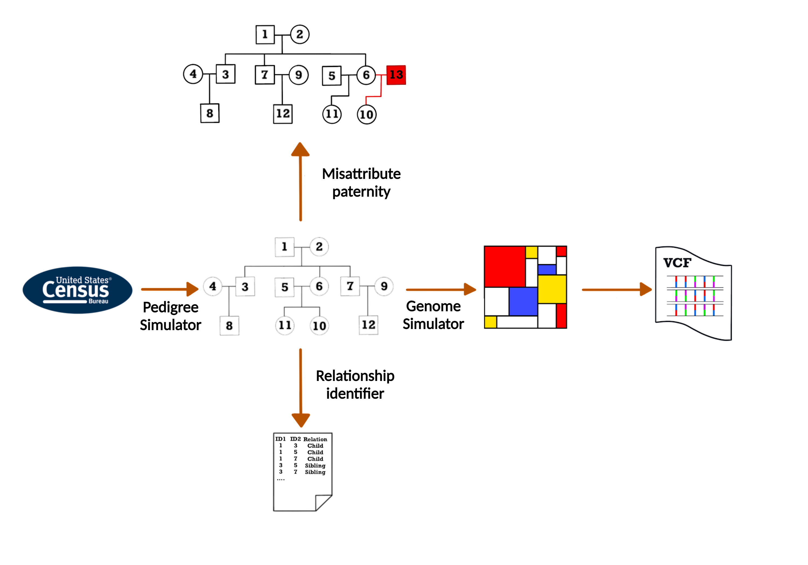
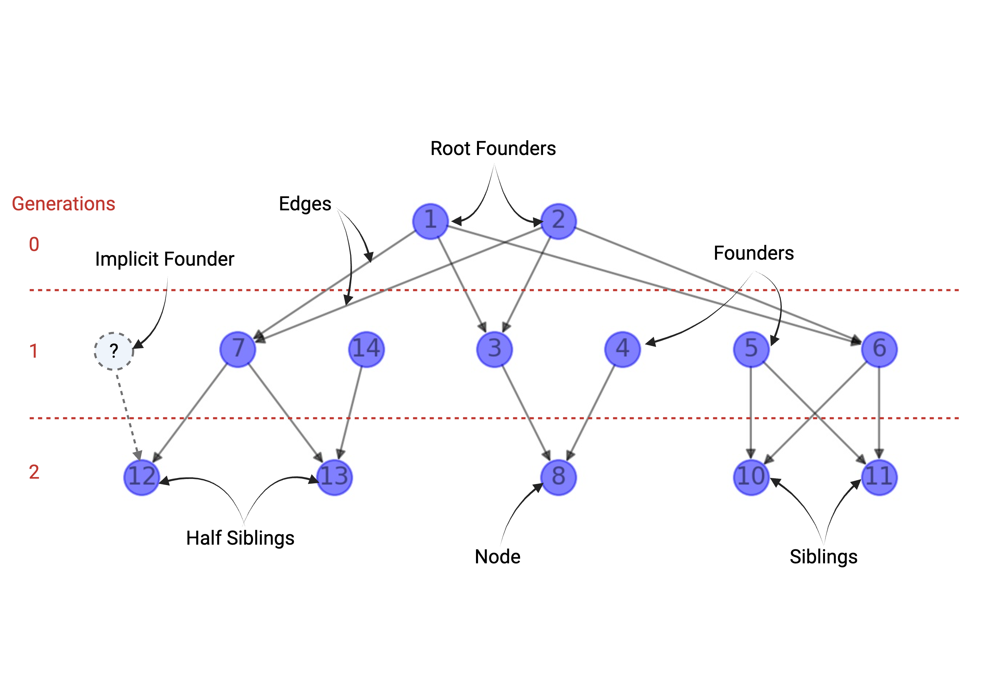

# ped_sim - Simulating Genetic Variance onto Family Pedigree



# Overview
`py_ped_sim` 
We have developed a python command-line-based tool called py_ped_sim that facilitates the simulation of pedigree 
structures and the genomes of individuals in a pedigree. py_ped_sim represents pedigrees as directed acyclic graphs, 
enabling conversion between standard pedigree formats and integration with the forward population genetic simulator, SLiM. 
Notably, py_ped_sim allows the simulation of varying numbers of offspring for a set of parents, with the capacity to 
shift the distribution of sibship sizes over generations. We additionally add simulations for events of 
misattributed paternity, which offers a way to simulate half-sibling relationships. 


This command line tool was developed with a python front end and uses SLiM as a forward genetic simulator to simulate genetic variance on non founders.
This software leverages family pedigrees as directed acyclic graph data structures where nodes represent individuals 
and directed edges represent parent-child relationships. While the input must be specified as [networkx](https://networkx.org/documentation/stable/tutorial.html#directed-graphs)
directed graph, you can additionally convert a standard ped file to a networkx based pedigree with this software.
 
Please feel free to reach out to me for any questions or suggestions 
I can create to make this code more useable! Miguel.Guardado@ucsf.edu

## Overview of Features

### Core Features

`sim_genomes` - Simulate genomes based on a fixed pedigree structure. Genetic simulations are preformed within SLiM. Genomes are outputted to the user within a VCF file

`sim_ped` - Simulate a pedigree structure based on inputs of sibship distributions across generations. 
User can specify their own distributions or use the default distributions provided by US Census (IPUMs)

`sim_map` - Simulate events of Misattributed Paternity, where someone who is presumed to be the individuals father is in fact not the biological father. 
User can specify how often this event will happen in the pedigree, in addition to how often the new biological father is within the family, or a new individual. 

`enur_fam` - This feature will determine all pairwise relationships within a family pedigree via 3 statistics. 
Meiosis Count, Generation Depth Difference, and Relation Type.

## Supplemental Features
`ped_to_networkx` - This is a helper function that is used to convert a standard pedigree (__.ped__) file into a networkx (__.nx__)  based family pedigree.

`networkx_to_ped` - This is a helper function that is used to convert a networkx based pedigree (__.nx__) file into a standard pedigree (__.ped__) file.

`check_founder` - This function is used return the meta information of the networkx pedigree, it will return the 
number of founders, num of implicit founders, and num of descendants inside the family.

`filter_vcf` - This function will filter vcf files for only bi-allelic SNPs. This function is an important preprocessing
step for VCF Files before genome simulations can be preformed in SLiM. Additionally it will create an info column for
the ancestral allele for each SNP, as is a requirement for inputting vcf files into SLiM. 

`fill_ped` - Fill in missing pedigree information for implicit founders (individuals where only one parent is defined)

`convert_pedigree` - This will preform the wrapper script to convert networkx-represented pedigrees into SLiM readable pedigree files. 
This function will only return you the SLiM readable pedigree file for mostly debugging purposes. 


## Basic Definitions 
Founders - Founders are defined as individuals who do not have any known ascendants. Explicit founders are classified 
as individuals who are defined in the pedigree. Implicit founders are defined in the case of incomplete pedigrees, 
when only on one parent is known for a descendants. Since our simulations need both parents to simulate the 
offspring, we refer to the missing parent as an implicit founder. My software is able to handle events of implicit founders, 
as long as you provide a genome for them inside the vcf file. 



## Install Conda Environment
You will need to have conda installed on your system. To install conda/mini conda onto your system follow this 
[link](https://conda.io/projects/conda/en/latest/user-guide/install/index.html).

Once you have conda installed on your system, check its working by the simple command
```bash
conda info
```

This repo includes a `ped_sim.yml` file that includes a virtual conda environment of all the software that is needed. 
Once you clone the repo to you directory, create and load the conda environment as follows.

```
cd ped_sim
conda env create -f ped_sim_env.yml
conda activate ped_sim
python setup.py install

#check pipeline interface is working though run_ped_sim.py
python run_ped_sim.py -h
```
For each of the simulation preformed in here you must specify the type of simulation you want preformed. This will be done
by the `-t` parameter. This parameter is **necessary** for any simulation preformed, or else the software will break.

Each feature of the software must be specified with the `-t` parameter. This parameter is **necessary** for any 
simulation preformed, or else the software will not run.

## Feature documentation

### sim_founder 
This feature will initialize the founders genome by running an additional genetic simulation prior to the main
family simulation. 
#### Required input parameters 

`-t sim_founder`

`-n` - networkx represented family pedigree

`-o` - output prefix of the file

##### Additional parameters  

`-r` - recombination rate to use for founder initialization + simulations (default = 1e-8)

`-mu` - mutation rate to use founder initialization + simulations (default = 1e-8)

`-n_gen` - Number of generations to use for founder genome burn in simulation (default = 12000)

`-n_indiv` - Number of individuals to use for founder genomes burn in simulation (default = 1000)

`-l` - length of the genome to simulation for founder burn in and pedigree simulation.

`-s` - Seed number to use for the genetic simulation (default = 1)

### sim_genome and sim_genome_exact

This will simulate genomes onto fixed pedigrees. Genomic simulations of pedigree is done in SLiM. Primarily our feature
is a wrapper that transforms the pedigree into a format that SLiM can read for the genomic simulations. An important 
step of this feature is assigning the founders from a user inputted vcf file to the founders in the genomic simulations,
you can either do it randomly (sim_genomes) or explicitly assigning genomes to founders (sim_genomes_exact).

Simulated genomes get outputted as VCF files. 

The user will specify the output prefix of the simulations results output file name via the `-o` user parameter.

**Note that VCF files must only have bi-allelic SNPs and have the ancestral allele information (AA) defined to input into SLiM, 
please preprocess your vcf file with `filter_vcf` before running genomic simulations.**

#### Required input parameters
`-t sim_genomes` or 
`-t sim_genomes_exact`

`-n` - networkx represented family pedigree

`-v` - vcf file for founder genome initialization

`-o` - output prefix of the file

`-e` - exact founder table (space delimited table with 2 columns [vcf_id, founder_id], refer to `test_data/load_founders/exact_founder_input.txt`)

#### Additional parameters
`-f` - fasta file for the inputted vcf file, this will activate nucleotide specifc simulations

`-r` - recombination rate to use for founder initialization + simulations (default = 1e-8)

`-mu` - mutation rate to use founder initialization + simulations (default = 1e-8)

`-s` - Seed number to use for the genetic simulation (default = 1)

#### Output
`{output_prefix}_genomes.vcf` - Genetic file of the family simulation. Input is presented as VCF format, information about vcf_file can
be found [here](https://www.internationalgenome.org/wiki/Analysis/Variant%20Call%20Format/vcf-variant-call-format-version-40/) 

`{output_prefix}_slim_pedigree.txt` - This will output the slim readable pedigree output that is read into SLiM for the genetic simulations.
The file looks similar to a ped file, but the columns for each file will be [Generation, Offsrping, Parent1, Parent2].


#### Example Usage to Assign Individuals Randomly (sim_genomes)
```bash
python run_ped_sim.py -t sim_genomes -n test_data/test_fam.nx -v test_data/load_founders/lwk_1kg_toydata_slim_fil.vcf -o testfam
```

#### Example Usage to Assign Individuals using specific individuals in a VCF file (sim_genomes_exact)
```bash
python run_ped_sim.py -t sim_genomes_exact -n test_data/test_fam.nx -e test_data/load_founders/exact_founder_input.txt -v test_data/load_founders/lwk_1kg_toydata_slim_fil.vcf -o testfam_exact
```

### sim_pedigree

### sim_map

### enur_fam 

### networkx_to_ped
This feature will convert networkx represented pedigree files into traditional family pedigrees files. 

##### Required input parameters:
`-n` - networkx represented family pedigree
`-o` - output prefix of the file

##### Additional parameters
`-pr` - networkx profiles to add to ped file. Only profiles supported are for birth year and sex.

##### Output
{output_prefix}.ped - traditional pedigree file

##### Exmple Usage
```bash
python run_ped_sim.py -t networkx_to_ped -n test_data/test_fam.nx -o test_data/test_fam
```
This will output `test_data/test_fam.ped`

### ped_to_networkx
This feature will convert traditional pedigree files into networkx represented family pedigrees. 

Required input parameters:

`-p` - Traditional family pedigree file

`-o` - output prefix of the file

##### Files that get outputted
{output_prefix}.nx - traditional networkx file

### check_founders
This feature is used for checking the number of explicit, implicit, and descendants created in the simulation.

##### Required input parameters

`-p` - Traditional family pedigree file

output of this function is outputted on the terminal command line

##### Exmple Usage
```bash
python run_ped_sim.py -t ped_to_networkx -p test_data/test_fam.ped -o test_data/test_fam
```
This will output `test_data/test_fam.nx`

### convert_pedigree
Internal debugging function that can be used to convert networkx represented family pedigree to a slim readable family pedigree.

Required input parameters:
`-n` - networkx represented family pedigree
`-o` - output prefix of the file

```bash
python run_ped_sim.py -t convert_pedigree -n test_data/test_fam.nx -o test_data/test_fam
```
This will output `test_data/test_fam_slim_pedigree.txt`
## References
Haller, B.C., and Messer, P.W. (2019). SLiM 3: Forward genetic simulations beyond the Wright–Fisher
model. Molecular Biology and Evolution 36(3), 632–637. DOI: https://doi.org/10.1093/molbev/
msy228

Aric A. Hagberg, Daniel A. Schult and Pieter J. Swart, “Exploring network structure, dynamics, and function using NetworkX”, 
in Proceedings of the 7th Python in Science Conference (SciPy2008), Gäel Varoquaux, 
Travis Vaught, and Jarrod Millman (Eds), (Pasadena, CA USA), pp. 11–15, Aug 200
