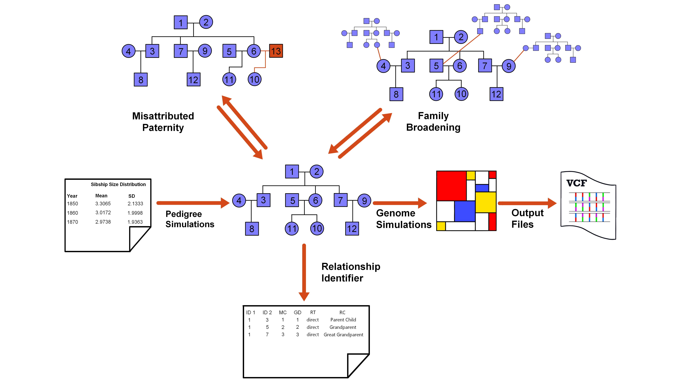
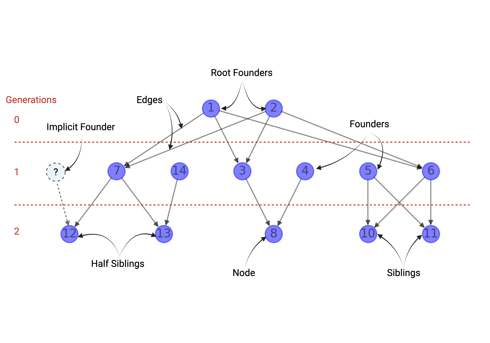

# py_ped_sim — A flexible forward pedigree and genetic simulator for complex family pedigree analysis



## Overview

`py_ped_sim` is a Python command-line tool that simulates pedigree structures and the genomes of the
individuals within them. Pedigrees are represented as directed acyclic graphs (DAGs), where nodes are
individuals and directed edges are parent → child relationships. This representation enables conversion
between standard pedigree formats and integration with the forward population genetic simulator
[SLiM](https://messerlab.org/slim/).

Notably, `py_ped_sim` allows the number of offspring per couple to vary and can shift the distribution of
sibship sizes across generations. It also simulates misattributed paternity events, providing a way to
generate half-sibling relationships.

Input pedigrees must be supplied as a [networkx](https://networkx.org/documentation/stable/tutorial.html#directed-graphs)
directed graph, but the tool can also convert a standard `.ped` file into a networkx pedigree for you.

Questions and suggestions are always welcome: **Miguel.Guardado@ucsf.edu**

---

## Features at a glance

Every feature is invoked through `run_ped_sim.py` and selected with the **`-t`** flag (see
[Command structure](#command-structure)).

### Core features

| Feature | `-t` value | Description |
|---|---|---|
| Pedigree structure simulator | `sim_ped` | Simulate a pedigree from sibship-size distributions across generations (your own, or the US Census / IPUMS defaults). |
| Misattributed paternity | `sim_map` | Simulate misattributed-paternity events on an existing pedigree, producing half-sibling relationships. |
| Genome simulator | `sim_genomes` / `sim_genomes_exact` | Simulate genomes onto a fixed pedigree in SLiM, output as a VCF. |
| Pairwise relationships | `enur_fam` | Identify every pairwise relationship in a pedigree via meiosis count, generation depth, and relationship type. |
| Family broadening | `run_full_family_broadening` | Simulate families and attach them to the non-root founders of a main family. |

### Supplemental features

| Feature | `-t` value | Description |
|---|---|---|
| Founder genome burn-in | `sim_founders` | Use msprime to simulate founder genomes under a constant demographic model. |
| VCF preprocessing | `filter_vcf` | Filter a VCF to bi-allelic SNPs and add ancestral-allele (AA) info required by SLiM. |
| Pedigree → networkx | `ped_to_networkx` | Convert a standard `.ped` file into a networkx `.nx` pedigree. |
| Networkx → pedigree | `networkx_to_ped` | Convert a networkx `.nx` pedigree into a standard `.ped` file. |
| Fill implicit founders | `fill_ped` | Fill in missing pedigree information for implicit founders (individuals with only one known parent). |
| Founder report | `check_founders` | Report the number of explicit founders, implicit founders, and descendants in a pedigree. |
| Networkx → SLiM pedigree | `convert_pedigree` | Convert a networkx pedigree into a SLiM-readable pedigree file (debugging utility). |
| Single family broadening | `run_single_family_broadening` | Connect two families at one specified individual in the main family. |

---

## Basic definitions

**Founders** are individuals with no known ancestors.

- **Explicit founders** are founders that are defined in the pedigree.
- **Implicit founders** arise in incomplete pedigrees, when only one parent is known for a descendant.
  Because simulations require both parents, the missing parent is treated as an implicit founder.
  `py_ped_sim` handles implicit founders as long as you provide a genome for them in the input VCF.



---

## Installation

You will need conda installed
([installation guide](https://conda.io/projects/conda/en/latest/user-guide/install/index.html)). Confirm it
works with:

```bash
conda info
```

This repo includes `ped_sim_env.yml`, a conda environment with all required dependencies. Clone the repo,
then create and activate the environment:

```bash
cd py_ped_sim
conda env create -f ped_sim_env.yml
conda activate ped_sim
python setup.py install

# confirm the interface works
python run_ped_sim.py -h
```

---

## Command structure

Every simulation is run through `run_ped_sim.py`, and the feature is chosen with the **`-t`** flag. This
flag is **required** — without it the software will not run.

```bash
python run_ped_sim.py -t <feature> [feature-specific flags]
```

The sections below document each feature with the same layout: a short **description**, an example
**usage** command, a **parameters** table, and the **output** it produces.

---

## Pedigree simulation

### `sim_ped` — pedigree structure simulator

Simulate pedigree structures with non-uniform sibship sizes across generations. This produces the pedigree
structure only (no genomes): a networkx pedigree plus a profiles file recording each individual's sex and
generation.

**Usage**

```bash
python run_ped_sim.py -t sim_ped -y 1880 1900 1920 -o 3gen_family
```

**Parameters**

| Flag | Description | Required / Default |
|---|---|---|
| `-y` | Years to sample, one per generation. Each year must exist in the sibship distribution file (`-c`). | Required |
| `-c` | Sibship distribution file. | Default: `scripts/ipumps_sibship_dist.txt` |
| `-s` | Random seed. | Default: random |
| `-o` | Output prefix. | Required |

Sibship distribution files are tab-delimited with a header (`Year`, `Mean`, `SD`); values were estimated
from IPUMS:

| Year | Mean | SD   |
|------|------|------|
| 1850 | 3.31 | 2.13 |
| 1860 | 3.11 | 2.00 |
| 1870 | 2.97 | 1.94 |

**Output**

- `{output_prefix}.nx` — pedigree as a networkx directed graph
- `{output_prefix}_profiles.txt` — per-individual `ID`, `Sex`, `Gen`

### `sim_map` — misattributed paternity simulator

Simulate misattributed-paternity (MP) events on an existing networkx pedigree. The tool traverses non-root
founders and, with the given probabilities, reassigns paternity — creating half-sibling relationships.

**Usage**

```bash
python run_ped_sim.py -t sim_map -n test_data/test_fam.nx -pr test_data/test_fam_profiles.txt -p1 0.10 -p2 0.50 -o test_data/test_fam_wmp
```

The example applies an MP rate of 0.10 with a within-family MP rate of 0.50.

**Parameters**

| Flag | Description | Required / Default |
|---|---|---|
| `-n` | Networkx pedigree file. | Required |
| `-pr` | Profiles file for the pedigree. | Required |
| `-p1` | Probability that an MP event occurs for a non-root founder. | Default: `0.01` |
| `-p2` | Probability that the new parent is within the family. | Default: `0.50` |
| `-o` | Output prefix. | Required |

**Output**

- `{output_prefix}.nx` and updated profiles reflecting the MP events

### `run_full_family_broadening` — family broadening

Create simulated families and attach them to the non-root founders of a main family. If no main family is
supplied it is simulated first; otherwise your supplied family is used.

> **Note:** When supplying your own main family (`-mf`), the `-y` years must match the generations present
> in that family (exclude the root-founder generation, include the last generation). Every `-y` year must
> also exist in the sibship distribution file (`-c`).

**Usage**

```bash
# simulate a main family, then broaden it
python run_ped_sim.py -t run_full_family_broadening -y 1850 1860 1870 -o joint_family

# broaden a main family you already have
python run_ped_sim.py -t run_full_family_broadening -y 1850 1880 1910 -mf test_data/test_fam.nx -o joint_family
```

**Parameters**

| Flag | Description | Required / Default |
|---|---|---|
| `-y` | Years to sample, one per generation. Each must exist in `-c`. | Required |
| `-c` | Sibship distribution file. | Default: `scripts/ipumps_sibship_dist.txt` |
| `-mf` | Main family file. Provide when using your own main family. | Optional |
| `-mo` | Output prefix for the simulated main family (used only when `-mf` is not supplied). | Default: `main_family` |
| `-o` | Output prefix for the final joint family. | Default: `joint_family_output` |

**Output**

- `{output_prefix}.nx` and `{output_prefix}_profiles.txt` — the final broadened pedigree
- `{mo}.nx` and `{mo}_profiles.txt` — the main family, **only** when it was simulated (no `-mf`)

### `run_single_family_broadening` — single family broadening

Connect two families into one graph at a single specified individual (founder) in the main family. This is
the building block used internally by `run_full_family_broadening`.

**Usage**

```bash
python run_ped_sim.py -t run_single_family_broadening \
  -n1 main_family.nx -n2 sub_family.nx \
  -pr1 main_family_profiles.txt -pr2 sub_family_profiles.txt \
  -o joint_family -cf 9
```

**Parameters**

| Flag | Description | Required / Default |
|---|---|---|
| `-n1` | Main family networkx file. | Required |
| `-n2` | Sub-family networkx file to attach. | Required |
| `-pr1` | Profiles file for the main family. | Required |
| `-pr2` | Profiles file for the sub-family. | Required |
| `-cf` | Founder in the main family to attach the sub-family onto. | Default: random (`empty`) |
| `-cs` | Substitute individual in the sub-family to use for the connection. | Default: random (`empty`) |
| `-o` | Output prefix. | Required |

**Output**

- `{output_prefix}.nx` and `{output_prefix}_profiles.txt` — the joint family

---

## Genome simulation

The typical genome-simulation pipeline is: **(1)** obtain founder genomes (`sim_founders` or your own VCF),
**(2)** preprocess the VCF (`filter_vcf`), then **(3)** simulate genomes onto a pedigree (`sim_genomes` /
`sim_genomes_exact`).

### `sim_founders` — founder genome burn-in

Initialize founder genomes with a genetic simulation prior to the main family simulation. Use this when you
do not have empirical genomes to seed `sim_genomes`. It implements a constant demographic model in msprime
(installed with the conda environment).

**Usage**

```bash
# 1000 founder genomes from a population of 100,000, genome length 100 kb
python run_ped_sim.py -t sim_founders -l 100000 -Ne 100000 -Nf 1000 -mu 1e-7 -r 1e-08 -o tmp_founder
```

**Parameters**

| Flag | Description | Required / Default |
|---|---|---|
| `-l` | Genome length (bp). | Default: `99999` |
| `-Ne` | Effective population size to simulate. | Default: `10000` |
| `-Nf` | Number of founders to sample (individuals written to the VCF). | Default: `5000` |
| `-mu` | Mutation rate. | Default: `1e-7` |
| `-r` | Recombination rate. | Default: `1e-8` |
| `-s` | Random seed. | Default: random |
| `-o` | Output prefix. | Required |

**Output**

- `{output_prefix}` VCF of simulated founder genomes

### `filter_vcf` — VCF preprocessing

Filter a VCF to bi-allelic SNPs and add the ancestral-allele (`AA`) INFO field. This is a **required**
preprocessing step before genome simulation, since SLiM requires bi-allelic SNPs with AA defined.

**Usage**

```bash
python run_ped_sim.py -t filter_vcf -v test_data/lwk_1kg_toydata.vcf
```

**Parameters**

| Flag | Description | Required / Default |
|---|---|---|
| `-v` | VCF file to filter. | Required |
| `-o` | Output prefix. | Optional |

**Output**

- A filtered, SLiM-ready VCF (e.g. `lwk_1kg_toydata_slim_fil.vcf`)

### `sim_genomes` / `sim_genomes_exact` — genome simulator

Simulate genomes onto a fixed pedigree in SLiM. The tool assigns founder genomes from your VCF either
**randomly** (`sim_genomes`) or by **explicit mapping** (`sim_genomes_exact`, via an exact-founder table).

> **Preprocess your VCF with `filter_vcf` first** (bi-allelic SNPs + AA required by SLiM).

**Usage**

```bash
# random founder assignment
python run_ped_sim.py -t sim_genomes -n test_data/test_fam.nx -v test_data/lwk_1kg_toydata_slim_fil.vcf -o testfam

# explicit founder assignment
python run_ped_sim.py -t sim_genomes_exact -n test_data/test_fam.nx -e test_data/exact_founder_input.txt -v test_data/lwk_1kg_toydata_slim_fil.vcf -o testfam_exact

# nucleotide-specific simulation (adds a fasta)
python run_ped_sim.py -t sim_genomes -f test_data/test_fam_fasta.fa -n test_data/test_fam.nx -v test_data/lwk_1kg_toydata_slim_fil.vcf -o testfam

# with a recombination map
python run_ped_sim.py -t sim_genomes_exact -n test_data/test_fam.nx -rm test_data/test_fam_recomb_map.txt -v test_data/lwk_1kg_toydata_slim_fil.vcf -o testfam_exact
```

**Parameters**

| Flag | Description | Required / Default |
|---|---|---|
| `-n` | Networkx pedigree file. | Required |
| `-v` | VCF file for founder genome initialization. | Required |
| `-e` | Exact-founder table: space-delimited, 2 columns `[vcf_id, founder_id]` (see `test_data/exact_founder_input.txt`). | Required for `sim_genomes_exact` |
| `-o` | Output prefix. | Required |
| `-f` | Fasta for the input VCF; activates nucleotide-specific simulation. | Optional |
| `-rm` | Recombination map (see format below). | Optional |
| `-r` | Recombination rate. | Default: `1e-8` |
| `-mu` | Mutation rate. | Default: `1e-7` |
| `-s` | Random seed. | Default: random |

**Recombination map format** — two-column, tab-delimited, no header. Column 1 is the region start position
in bases (beginning at 1); column 2 is the recombination rate for that region in cM/Mbp. Values are
converted to scientific notation with exponent `-8` for SLiM (e.g. `1.8` → `1.8e-8`).

| 1    | 0   |
|------|-----|
| 3000 | 1.8 |
| 4503 | 1.6 |

**Output**

- `{output_prefix}_genomes.vcf` — simulated genomes ([VCF format reference](https://www.internationalgenome.org/wiki/Analysis/Variant%20Call%20Format/vcf-variant-call-format-version-40/))
- `{output_prefix}_slim_pedigree.txt` — the SLiM-readable pedigree, columns `[Generation, Offspring, Parent1, Parent2]`

> **Note on output alignment:** the resulting VCF is not aligned to the input founder genome. If founders
> came from chromosome 2, the output defaults to chromosome 1, and SNP positions default to a Ref of `A`
> and Alt of `T`. To preserve chromosome/positions, use nucleotide-specific simulation (`-f`).

---

## Relationship analysis

### `enur_fam` — pairwise relationship identifier

Identify every pairwise relationship in a pedigree, summarized by three statistics plus a human-readable
label:

- **MC** — meiosis count
- **GD** — generation depth (difference)
- **RT** — relationship type (`direct`, `full`, or `half`)
- **RC** — relationship code (named relationship derived from MC, GD, and RT)

The relationship code generalizes to arbitrary cousin degrees and removals following standard genealogy
(e.g. `First Cousin Once Removed`, `Full Great-Aunt/Uncle`, `Sixth Cousin`).

```
MC=1, GD=1, RT=direct → Parent Child
MC=2, GD=0, RT=full   → Full Sibling
MC=2, GD=0, RT=half   → Half Sibling
```

**Usage**

```bash
# all pairwise relationships in the family
python run_ped_sim.py -t enur_fam -n test_data/test_fam.nx

# only relationships involving a subset of individuals
python run_ped_sim.py -t enur_fam -n test_data/test_fam.nx -sf test_data/test_fam_sample.txt
```

**Parameters**

| Flag | Description | Required / Default |
|---|---|---|
| `-n` | Networkx pedigree file. | Required |
| `-sf` | Single-column file of individual IDs to identify relationships for. | Optional |
| `-o` | Output prefix. | Optional (defaults to the input filename) |

**Output**

- `{output_prefix}_rel.csv` — columns `Fam_ID`, `ID1`, `ID2`, `MC`, `GD`, `RT`, `RC`

---

## File conversion & utilities

### `ped_to_networkx` — pedigree → networkx

Convert a standard `.ped` file into a networkx `.nx` pedigree.

**Usage**

```bash
python run_ped_sim.py -t ped_to_networkx -p test_data/test_fam.ped -o test_data/test_fam
```

**Parameters**

| Flag | Description | Required / Default |
|---|---|---|
| `-p` | Standard `.ped` pedigree file. | Required |
| `-o` | Output prefix. | Required |

**Output**

- `{output_prefix}.nx`

### `networkx_to_ped` — networkx → pedigree

Convert a networkx `.nx` pedigree into a standard `.ped` file.

**Usage**

```bash
python run_ped_sim.py -t networkx_to_ped -n test_data/test_fam.nx -o test_data/test_fam
```

**Parameters**

| Flag | Description | Required / Default |
|---|---|---|
| `-n` | Networkx pedigree file. | Required |
| `-o` | Output prefix. | Required |
| `-pr` | Profiles file to add birth year and sex to the `.ped`. | Optional |

**Output**

- `{output_prefix}.ped`

### `fill_ped` — fill implicit founders

Fill in missing pedigree information for implicit founders (individuals with only one known parent).

**Usage**

```bash
python run_ped_sim.py -t fill_ped -n test_data/test_fam.nx -o test_data/test_fam_filled
```

**Parameters**

| Flag | Description | Required / Default |
|---|---|---|
| `-n` | Networkx pedigree file. | Required |
| `-o` | Output prefix. | Required |

### `check_founders` — founder report

Report the number of explicit founders, implicit founders, and descendants in a pedigree. Output is printed
to the terminal.

**Usage**

```bash
python run_ped_sim.py -t check_founders -n test_data/test_fam.nx
```

**Parameters**

| Flag | Description | Required / Default |
|---|---|---|
| `-n` | Networkx pedigree file. | Required |

### `convert_pedigree` — networkx → SLiM pedigree

Convert a networkx pedigree into a SLiM-readable pedigree file. Primarily a debugging utility.

**Usage**

```bash
python run_ped_sim.py -t convert_pedigree -n test_data/test_fam.nx -o test_data/test_fam
```

**Parameters**

| Flag | Description | Required / Default |
|---|---|---|
| `-n` | Networkx pedigree file. | Required |
| `-o` | Output prefix. | Required |

**Output**

- `{output_prefix}_slim_pedigree.txt`

---

## References

Haller, B.C., and Messer, P.W. (2019). SLiM 3: Forward genetic simulations beyond the Wright–Fisher model.
*Molecular Biology and Evolution* 36(3), 632–637. DOI: https://doi.org/10.1093/molbev/msy228

Aric A. Hagberg, Daniel A. Schult, and Pieter J. Swart, "Exploring network structure, dynamics, and
function using NetworkX", in *Proceedings of the 7th Python in Science Conference (SciPy2008)*, Gäel
Varoquaux, Travis Vaught, and Jarrod Millman (Eds), (Pasadena, CA USA), pp. 11–15, Aug 2008.